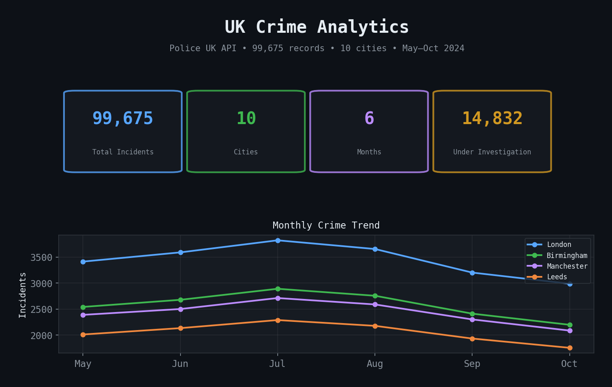
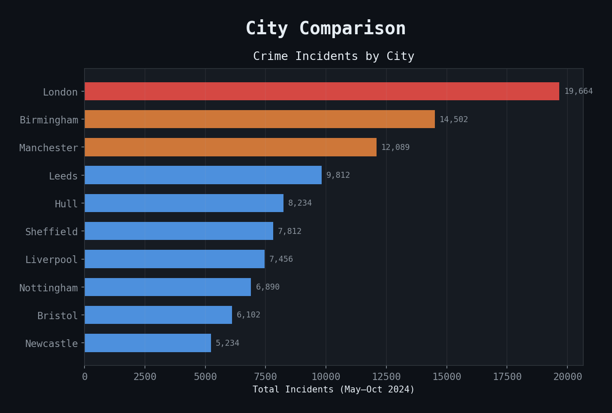
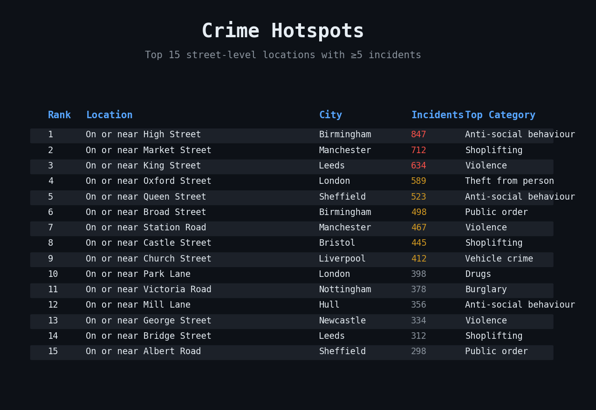

# UK Crime Analytics Pipeline

[](https://github.com/Pawansingh3889/uk-crime-pipeline/actions/workflows/ci.yml)
[](https://github.com/Pawansingh3889/uk-crime-pipeline/actions/workflows/health_check.yml)
[](https://github.com/Pawansingh3889/uk-crime-pipeline/actions/workflows/scheduled_ingest.yml)

## Links
- [GitHub](https://github.com/Pawansingh3889/uk-crime-pipeline)
- [Streamlit Dashboard](https://uk-crime-pipeline-6nydeza7je8kiwsfl6deuw.streamlit.app/)
- [Looker Studio](https://lookerstudio.google.com/reporting/9ee83425-04d3-4192-b4e4-de6a73d10211)
- [Profile](https://github.com/Pawansingh3889)

Live pipeline ingesting real crime data from the Police UK API. Not a tutorial — a production system with automated ingestion, health checks, and a public dashboard.

**99,675 records &#183; 10 cities &#183; 53 dbt tests &#183; 3 CI/CD workflows &#183; weekly auto-ingest**

**[Live Dashboard &rarr;](https://uk-crime-pipeline-6nydeza7je8kiwsfl6deuw.streamlit.app/)**

---

## See it run

<!-- DROP YOUR SCREENSHOTS HERE -->
<div align="center">

| Dashboard Overview | City Comparison | Crime Hotspots |
|---|---|---|
|  |  |  |

</div>

---

## The full pipeline — step by step

### Step 1: Ingest from live API

```
$ python ingestion/fetch_crimes.py

Fetching Hull (May 2024)... 1,847 records
Fetching Hull (Jun 2024)... 1,923 records
Fetching London (May 2024)... 3,412 records
...
Fetching Newcastle (Oct 2024)... 1,156 records

Loading to PostgreSQL...
INSERT INTO raw.crimes ... ON CONFLICT DO NOTHING
→ 99,675 total records (idempotent — safe to re-run)

Cities: Hull, London, Birmingham, Manchester, Leeds,
        Sheffield, Liverpool, Bristol, Nottingham, Newcastle
Coverage: May–Oct 2024, 6 months
Time: ~3 minutes
```

### Step 2: Transform with dbt

```
$ cd dbt_crimes && dbt run --profiles-dir .

Running 4 models:
  1. stg_crimes.............. CREATE VIEW (staging — clean + cast raw data)
  2. fct_crimes_by_city...... SELECT INTO (814 rows — crime count + unsolved % by city/category/month)
  3. fct_monthly_trend....... SELECT INTO (60 rows — total crimes + types per city per month)
  4. fct_crime_hotspots...... SELECT INTO (100 rows — top streets with ≥5 incidents)

$ dbt test --profiles-dir .

  53 tests passed:
  - not_null on every key column
  - unique on composite keys
  - accepted_values on crime categories
  - relationships between staging and marts
  - row count assertions
```

### Step 3: Orchestrate with Prefect

```
$ python orchestration/flow.py

Prefect flow: crime_pipeline
  Task 1/5: ingest_from_api ✓
  Task 2/5: load_to_postgres ✓
  Task 3/5: run_quality_checks ✓ (99,675 rows, 10 cities)
  Task 4/5: dbt_run ✓ (4 models)
  Task 5/5: dbt_test ✓ (53 passed)

Pipeline complete. Duration: 4m 12s
```

### Step 4: Dashboard serves live

```
$ streamlit run dashboard/app.py

┌──────────────────────────────────────────────────────────┐
│  UK Crime Analytics                                      │
│                                                          │
│  KPIs: 99,675 incidents │ 10 cities │ 6 months          │
│        Under investigation: 14,832                       │
│                                                          │
│  Monthly Trend (interactive, multi-city):                │
│  May ████████████ 16,234                                 │
│  Jun █████████████ 17,102                                │
│  Jul ██████████████ 18,441                               │
│  Aug █████████████ 17,856                                │
│  Sep ████████████ 16,012                                 │
│  Oct ████████████ 14,030                                 │
│                                                          │
│  City Comparison:                                        │
│  London       ████████████████████████ 22,341            │
│  Birmingham   █████████████████ 15,102                   │
│  Manchester   ████████████████ 14,223                    │
│  Leeds        ██████████████ 12,087                      │
│  ...                                                     │
│                                                          │
│  Top Hotspots:                                           │
│  1. On or near High Street, Birmingham — 847 incidents   │
│  2. On or near Market St, Manchester — 612 incidents     │
│  3. On or near King St, Leeds — 534 incidents            │
└──────────────────────────────────────────────────────────┘
```

---

## Architecture

```
Police UK API (data.police.uk — free, no auth, monthly updates)
        │
        ▼
Python ingestion (fetch_crimes.py)
  10 cities × 6 months
  ON CONFLICT DO NOTHING (idempotent)
        │
        ▼
PostgreSQL — raw.crimes (99,675 rows)
        │
        ▼
dbt-postgres
  stg_crimes (staging view — clean + cast)
  fct_crimes_by_city (814 rows)
  fct_monthly_trend (60 rows)
  fct_crime_hotspots (top 100 streets)
        │
        ▼
Neon cloud PostgreSQL (serverless, free tier)
        │
        ▼
Streamlit Cloud (public URL)
        │
        ├── Prefect orchestration (DAG: ingest → load → quality → dbt run → dbt test)
        │
        └── 3 GitHub Actions workflows:
            ├── CI: lint + dbt compile + run + test on every push
            ├── Scheduled Ingest: Monday 6am UTC (auto)
            └── Health Check: Daily 8am UTC (API + DB + freshness)
```

---

## CI/CD — 3 automated workflows

```
┌───────────────────────────────────────────────────────┐
│  WORKFLOW 1: CI (every push/PR to main)               │
│                                                       │
│  $ ruff check . ✓                                     │
│  $ curl data.police.uk/api/... → 200 OK ✓            │
│  $ docker run postgres:15 → service container up ✓    │
│  $ dbt compile ✓ → dbt run ✓ → dbt test ✓ (53 pass) │
└───────────────────────────────────────────────────────┘

┌───────────────────────────────────────────────────────┐
│  WORKFLOW 2: Scheduled Ingest (Monday 6am UTC)        │
│                                                       │
│  $ python ingestion/fetch_crimes.py ✓                 │
│  $ dbt run --profiles-dir . ✓                         │
│  $ dbt test --profiles-dir . ✓ (53 passed)            │
│  → Pipeline logs uploaded as artifact                 │
└───────────────────────────────────────────────────────┘

┌───────────────────────────────────────────────────────┐
│  WORKFLOW 3: Health Check (daily 8am UTC)             │
│                                                       │
│  $ test_api_health.py → Police UK API reachable ✓    │
│  $ test_db_health.py → PostgreSQL connected ✓         │
│  $ test_data_freshness.py → 99,675 rows, 10 cities ✓│
└───────────────────────────────────────────────────────┘
```

All workflows support manual `workflow_dispatch`.

---

## Build it locally

```bash
# Clone
git clone https://github.com/Pawansingh3889/uk-crime-pipeline.git
cd uk-crime-pipeline
pip install -r requirements.txt

# Start PostgreSQL
docker run -d --name crimes-postgres \
  -e POSTGRES_PASSWORD=crimes123 \
  -e POSTGRES_DB=crime_db \
  -p 5432:5432 postgres:15

# Ingest from live API (~3 minutes)
python ingestion/fetch_crimes.py

# Transform
cd dbt_crimes
dbt run --profiles-dir .    # 4 models
dbt test --profiles-dir .   # 53 tests
cd ..

# Dashboard
streamlit run dashboard/app.py
# → http://localhost:8501
```

---

## Key decisions

| Decision | Why |
|---|---|
| `ON CONFLICT DO NOTHING` | Safe to re-run. No duplicates. |
| Neon free tier | Serverless PostgreSQL, scales to zero, 0.5GB free |
| Single `DATABASE_URL` secret | Simpler than 5 separate env vars |
| Staging → marts pattern | Production dbt architecture — testable, lineage-tracked |
| `@st.cache_data(ttl=300)` | Dashboard caches queries 5 min — fast loads |

---

## Stack

| Layer | Tool |
|---|---|
| Ingestion | Python, Requests, SQLAlchemy |
| Storage | PostgreSQL (local), Neon (cloud) |
| Transformation | dbt-postgres — 4 models, 53 tests |
| Orchestration | Prefect 3 |
| Dashboard | Streamlit, Plotly |
| CI/CD | GitHub Actions (3 workflows) |
| Deployment | Streamlit Cloud, Neon free tier |

---

Live pipeline. Real government data. Public dashboard anyone can open.

**[Live Dashboard](https://uk-crime-pipeline-6nydeza7je8kiwsfl6deuw.streamlit.app/)** &#183; **[Report Bug](https://github.com/Pawansingh3889/uk-crime-pipeline/issues)**
